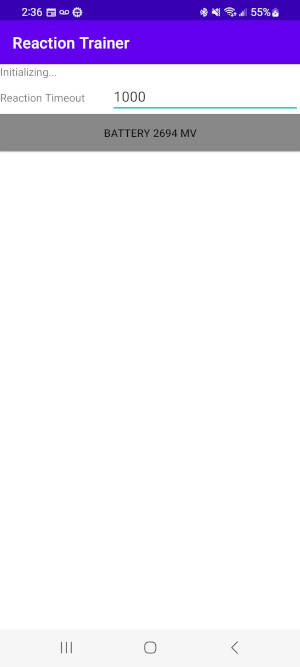

# Next-Generation Reaction Trainer

This repository contains the Android Application to interact with the Device.

## Usage

This application enumerates all Reaction Trainer Pods that are within Bluetooth range and 
allows to connect to them. Once connected, the application allows to configure the device 
and start a training session.

At the time of contest submission this application is not fully featured yet. It is missing
event handlers to receipt taps from the accelerometer. This will be added in the future.

The main screen allows to configure the reaction timeouts for the Pods. When tapping a Pod
the Pod will flash with the configured reaction timeout or until a tap occurs (future).

The main screen is shown below: 

Each discovered Pod is displayed with the current battery voltage. If the Pod is armed
the button will change to a bright green from gray.

## Future
 * Pod accelerometer integration
 * Pre-configured circuits from the application

## Used Tools
 * IntelliJ Idea 2023.1.4
 * Samsung Galaxy S20+

See [my blog post](https://www.reidemeister.com/?p=624) for more information and build updates.

 * [Firmware Sources and Overview](https://github.com/treideme/reaction-trainer)
 * [Hardware Designs](https://github.com/treideme/reaction-trainer-hw)

----
(C) 2023 Thomas Reidemeister, released under [Apache 2](LICENSE).